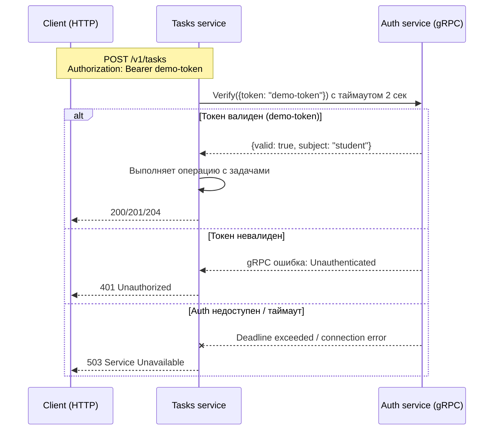
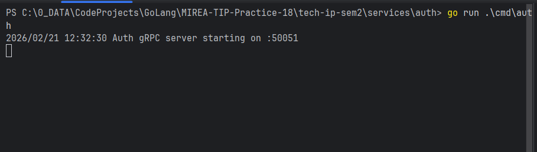
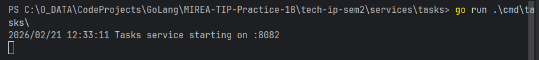
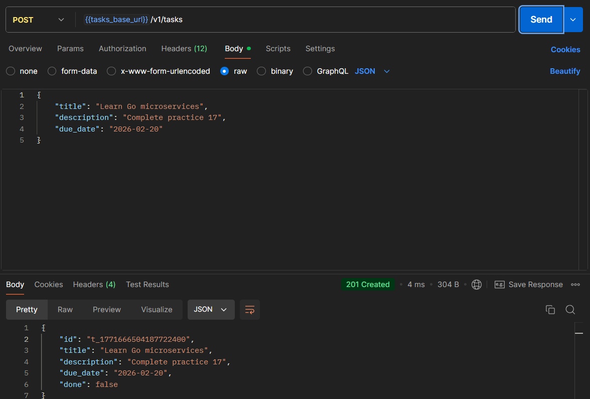
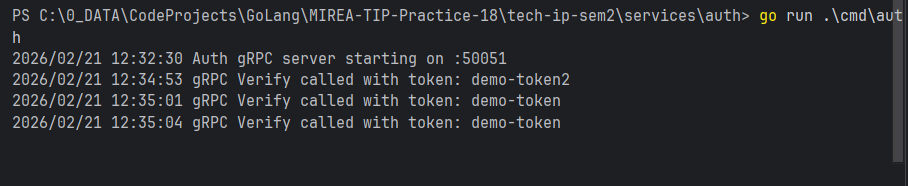
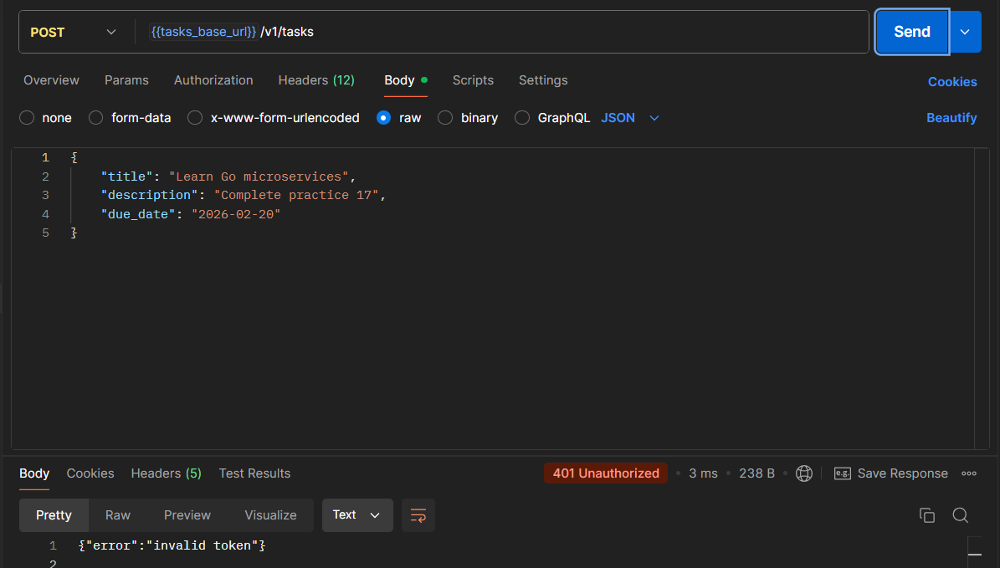
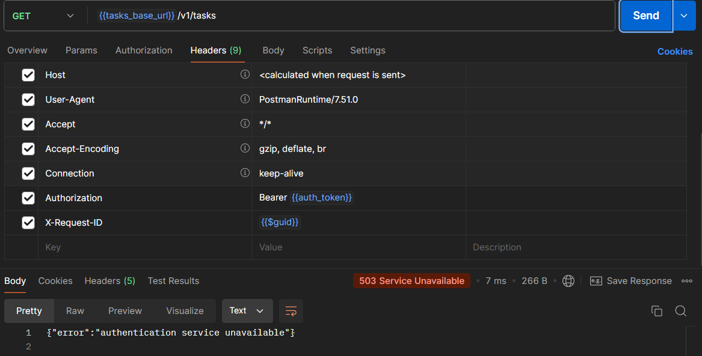
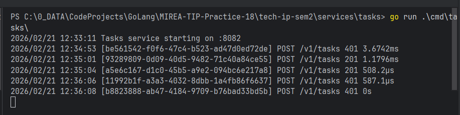
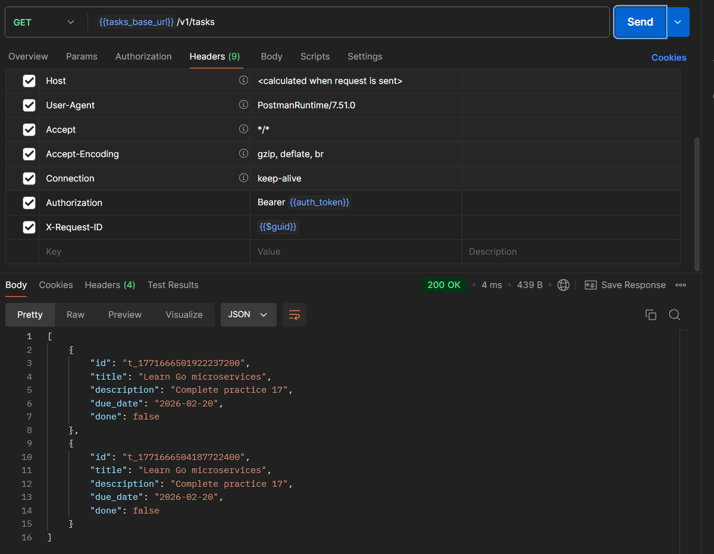

# Практическое занятие №2 (18). gRPC: создание простого микросервиса, вызовы методов

## ЭФМО-01-25 Туев Д.


## Содержание

1. [Описание проекта](#описание-проекта)
2. [Границы сервисов](#границы-сервисов)
3. [Архитектура решения](#архитектура-решения)
4. [Proto-контракт](#proto-контракт)
5. [Реализация](#реализация)
6. [API спецификация](#api-спецификация)
7. [Запуск сервисов](#запуск-сервисов)
8. [Тестирование](#тестирование)
9. [Скриншоты выполнения](#скриншоты-выполнения)
10. [Выводы](#выводы)
11. [Контрольные вопросы](#контрольные-вопросы)

---

## Описание проекта

Проект представляет собой систему из двух микросервисов, взаимодействующих через gRPC:

- **Auth service** — gRPC сервер, реализующий метод Verify для проверки токенов. **Не имеет HTTP интерфейса.**
- **Tasks service** — HTTP REST API для работы с задачами, который при каждом запросе вызывает Auth service по gRPC для проверки токена.

**Цель работы:** Научиться работать с gRPC: описывать контракт в .proto, поднимать gRPC-сервер и вызывать его из другого сервиса с дедлайном.

---

## Границы сервисов

| Сервис | Зона ответственности | Интерфейс |
|--------|----------------------|-----------|
| **Auth service** | Проверка токенов (фиксированный токен `demo-token`) | gRPC (порт 50051) |
| **Tasks service** | CRUD задач, проверка доступа перед операциями | HTTP REST API (порт 8082) + gRPC клиент к Auth |

---

## Архитектура решения

### Схема взаимодействия

```
[Клиент (Postman/curl)]
│
│ HTTP/JSON (порт 8082) с заголовком Authorization
▼
[Tasks service]
│
│ gRPC вызов Verify (порт 50051) с таймаутом 2 сек
▼
[Auth service]
│ (проверка токена)
▼
[Возврат результата: true/false]
```

### Детализация gRPC вызова


[//]: # (todo)


---

## Proto-контракт

Файл `proto/auth.proto`:

```protobuf
syntax = "proto3";

package auth;

option go_package = "github.com/sun1tar/MIREA-TIP-Practice-18/tech-ip-sem2/proto/auth";

service AuthService {
  rpc Verify(VerifyRequest) returns (VerifyResponse);
}

message VerifyRequest {
  string token = 1;
}

message VerifyResponse {
  bool valid = 1;
  string subject = 2;
}
```

### Команды генерации кода

```bash
# Установка плагинов (однократно)
go install google.golang.org/protobuf/cmd/protoc-gen-go@latest
go install google.golang.org/grpc/cmd/protoc-gen-go-grpc@latest

# Генерация из корня проекта
protoc --proto_path=proto --go_out=proto --go_opt=paths=source_relative \
  --go-grpc_out=proto --go-grpc_opt=paths=source_relative proto/auth.proto
```

После генерации появляются файлы:
- `proto/auth/auth.pb.go`
- `proto/auth/auth_grpc.pb.go`

---

## Реализация

### Auth service (gRPC сервер)

**Расположение:** `services/auth/`

**Точка входа:** `cmd/auth/main.go` — запускает gRPC сервер на порту 50051

**Реализация метода Verify:** `internal/grpc/server.go`

```go
func (s *Server) Verify(ctx context.Context, req *pb.VerifyRequest) (*pb.VerifyResponse, error) {
    valid, subject := service.VerifyToken(req.Token)
    if !valid {
        return nil, status.Error(codes.Unauthenticated, "invalid token")
    }
    return &pb.VerifyResponse{Valid: true, Subject: subject}, nil
}
```

**Бизнес-логика:** `internal/service/auth.go` — проверяет, что токен равен `demo-token`

### Tasks service (HTTP API + gRPC клиент)

**Расположение:** `services/tasks/`

**Точка входа:** `cmd/tasks/main.go`:
- Запускает HTTP сервер на порту 8082
- Создаёт gRPC клиент к Auth по адресу `AUTH_GRPC_ADDR` (по умолчанию `localhost:50051`)
- Устанавливает таймаут 2 секунды на gRPC вызовы

**gRPC клиент:** `internal/client/authclient/client.go` — реализует метод `VerifyToken` с таймаутом и обработкой ошибок:

| gRPC статус | Действие клиента |
|-------------|------------------|
| `Unauthenticated` | Возвращает `valid=false, err=nil` |
| `DeadlineExceeded` | Возвращает ошибку "auth service timeout" |
| `Unavailable` / другие | Возвращает ошибку "auth service unavailable" |

**HTTP обработчики:** `internal/http/handlers.go` — каждый защищённый эндпоинт вызывает `verifyToken` перед выполнением операции.

---

## API спецификация

### Auth service

Auth service **не предоставляет HTTP API**. Доступен только gRPC метод:

**gRPC метод:** `auth.AuthService.Verify`

**Request:**
```json
{
  "token": "demo-token"
}
```

**Response (успех):**
```json
{
  "valid": true,
  "subject": "student"
}
```

**Response (ошибка):** gRPC статус `Unauthenticated` с сообщением "invalid token"

---

### Tasks service (HTTP REST API)

Базовый URL: `http://localhost:8082`

Все запросы требуют заголовок `Authorization: Bearer <token>`. Токен проверяется через gRPC вызов к Auth service.

#### `POST /v1/tasks` — создание задачи

**Request:**
```json
{
    "title": "Изучить gRPC",
    "description": "Практическое занятие 18",
    "due_date": "2026-02-28"
}
```

**Response 201:**
```json
{
    "id": "t_1739876543210",
    "title": "Изучить gRPC",
    "description": "Практическое занятие 18",
    "due_date": "2026-02-28",
    "done": false
}
```

#### `GET /v1/tasks` — список всех задач

**Response 200:**
```json
[
    {
        "id": "t_1739876543210",
        "title": "Изучить gRPC",
        "done": false
    }
]
```

#### `GET /v1/tasks/{id}` — получить задачу по ID

**Response 200:** объект задачи (аналогично POST)

**Response 404:**
```json
{"error":"task not found"}
```

#### `PATCH /v1/tasks/{id}` — обновить задачу

**Request** (все поля опциональны):
```json
{
    "title": "Обновлённый заголовок",
    "done": true
}
```

**Response 200:** обновлённая задача

#### `DELETE /v1/tasks/{id}` — удалить задачу

**Response 204** (без тела)

### Ошибки Tasks service

| Код | Описание | Тело ответа |
|-----|----------|-------------|
| 400 | Неверный формат запроса | `{"error":"invalid request body"}` |
| 400 | Отсутствует обязательное поле | `{"error":"title is required"}` |
| 401 | Отсутствует Authorization header | `{"error":"missing authorization header"}` |
| 401 | Неверный формат заголовка | `{"error":"invalid authorization header format"}` |
| 401 | Неверный токен | `{"error":"invalid token"}` |
| 503 | Auth service недоступен (таймаут/ошибка) | `{"error":"authentication service unavailable"}` |
| 404 | Задача не найдена | `{"error":"task not found"}` |

---

## Запуск сервисов

### Предварительные требования

- Go 1.22 или выше
- Установленный `protoc` и плагины (только для генерации, не для запуска)
- Свободные порты: 50051 (Auth gRPC), 8082 (Tasks HTTP)

### Переменные окружения

**Auth service:**
- `AUTH_GRPC_PORT` — gRPC порт (по умолчанию 50051)

**Tasks service:**
- `TASKS_PORT` — HTTP порт (по умолчанию 8082)
- `AUTH_GRPC_ADDR` — адрес gRPC сервера Auth (по умолчанию `localhost:50051`)

### Команды для запуска

#### Терминал 1 (Auth service)

```bash
cd services/auth
go mod tidy
export AUTH_GRPC_PORT=50051
go run ./cmd/auth
```

Ожидаемый вывод:
```
Auth gRPC server starting on :50051
```

#### Терминал 2 (Tasks service)

```bash
cd services/tasks
go mod tidy
export TASKS_PORT=8082
export AUTH_GRPC_ADDR=localhost:50051
go run ./cmd/tasks
```

Ожидаемый вывод:
```
Tasks service starting on :8082
```

---

## Тестирование

### 1. Проверка gRPC сервера
Проверка gRPC сервера напрямую не осуществляется по HTTP

### 2. Тестирование Tasks service

#### Создание задачи (успех)

```bash
curl -i -X POST http://localhost:8082/v1/tasks \
  -H "Content-Type: application/json" \
  -H "Authorization: Bearer demo-token" \
  -d '{"title":"Тест gRPC","description":"Проверка связи"}'
```

**Ожидаемый ответ:** 201 Created с телом задачи.

#### Получение списка задач

```bash
curl -i -X GET http://localhost:8082/v1/tasks \
  -H "Authorization: Bearer demo-token"
```

#### Попытка создания задачи с неверным токеном

```bash
curl -i -X POST http://localhost:8082/v1/tasks \
  -H "Content-Type: application/json" \
  -H "Authorization: Bearer wrong-token" \
  -d '{"title":"Должно провалиться"}'
```

**Ожидаемый ответ:** 401 Unauthorized с `{"error":"invalid token"}`

#### Проверка таймаута (остановите Auth service)

```bash
# Остановите Auth (Ctrl+C), затем выполните:
curl -i -X POST http://localhost:8082/v1/tasks \
  -H "Content-Type: application/json" \
  -H "Authorization: Bearer demo-token" \
  -d '{"title":"Таймаут"}'
```

**Ожидаемый ответ:** 503 Service Unavailable с `{"error":"authentication service unavailable"}`

---

## Скриншоты выполнения

> **Важно:** Ниже указаны места для вставки скриншотов. Замените `[PLACEHOLDER: описание]` на реальные изображения.

### 1. Запуск Auth service (gRPC сервер)




### 2. Запуск Tasks service (HTTP сервер + gRPC клиент)



### 3. Тестирование gRPC метода через grpcurl 

Осуществлялось через HTTP копию сервиса

### 4. Успешное создание задачи через Tasks API




### 5. Логи с подтверждением gRPC вызова



### 6. Ошибка при неверном токене



### 7. Таймаут при недоступном Auth service



### 8. Прокидывание request-id (логи)



### 9. Список задач после создания



---

## Выводы

В ходе выполнения практического занятия № 2 были достигнуты следующие результаты:

1. **Разработан proto-контракт** для сервиса аутентификации с методом Verify.
2. **Реализован gRPC сервер** в Auth service, обрабатывающий проверку токенов на порту 50051.
3. **Реализован gRPC клиент** в Tasks service, интегрированный в существующую HTTP логику.
4. **Настроены таймауты** (2 секунды) для всех gRPC вызовов, предотвращающие зависание при недоступности Auth.
5. **Реализован корректный маппинг ошибок**: gRPC статусы преобразуются в соответствующие HTTP статусы:
    - `Unauthenticated` → 401 Unauthorized
    - `DeadlineExceeded` → 503 Service Unavailable
    - `Unavailable` → 503 Service Unavailable
6. **Auth service не имеет HTTP интерфейса** — всё взаимодействие только через gRPC, что соответствует современным практикам микросервисной архитектуры.
7. **Сквозная трассировка** реализована через прокидывание request-id в HTTP заголовках и контексте.

Таким образом, система полностью переведена на внутреннее gRPC взаимодействие, что повышает производительность и надёжность коммуникации между микросервисами.

---

## Контрольные вопросы

### 1. Что такое .proto и почему он считается контрактом?

`.proto` файл — это формальное описание интерфейса gRPC сервиса и форматов сообщений на языке Protocol Buffers. Он является контрактом, потому что:
- Задаёт строгую типизацию полей (int32, string, bool и т.д.)
- Определяет структуру запросов и ответов
- Указывает номера полей для обратной совместимости
- Служит единственным источником правды для генерации клиентов и серверов на разных языках
- Любые изменения контракта должны быть согласованы между поставщиком и потребителями

### 2. Что такое deadline в gRPC и чем он полезен?

Deadline (или таймаут) — это максимальное время, которое клиент готов ждать ответа от сервера. В gRPC он задаётся через контекст: `context.WithTimeout(ctx, 2*time.Second)`.

Польза:
- Предотвращает зависание клиента при недоступности сервера
- Позволяет быстро освобождать ресурсы (горутины, соединения)
- Даёт возможность вернуть клиенту понятную ошибку (503) вместо бесконечного ожидания
- На стороне сервера позволяет отменить обработку, если клиент уже отключился

### 3. Почему "exactly-once" не даётся просто так даже в RPC?

Гарантия "exactly-once" (ровно один раз) сложна из-за возможных сбоев:
- Сеть может потерять запрос или ответ
- Сервер может упасть после обработки, но до отправки подтверждения
- Таймауты могут сработать до получения ответа
- Повторные попытки могут привести к дублированию операций

gRPC по умолчанию предоставляет "at-most-once" (не более одного раза) для отдельных вызовов. Для "exactly-once" требуется идемпотентность операций на стороне сервера и механизмы дедупликации.

### 4. Как обеспечивать совместимость при расширении .proto?

При расширении .proto файла совместимость обеспечивается правилами Protocol Buffers:
- **Нельзя изменять номера полей** после использования
- **Нельзя удалять поля** — можно помечать как `reserved`
- **Новые поля должны добавляться с новыми номерами**
- Можно использовать `optional` для обратной совместимости
- Старые клиенты игнорируют неизвестные поля
- Для критических изменений создают новую версию сервиса (например, `AuthServiceV2`)

---

## Приложение: Postman коллекция

В репозитории доступна [Postman коллекция](https://www.postman.com/lively-flare-564043/workspace/learning/collection/42992055-840983f9-8b75-41a0-ba8b-3be8e762494e).

**Важно:** Auth service не имеет HTTP API. Для проверки gRPC используйте `grpcurl` с командами, указанными в разделе тестирования.


